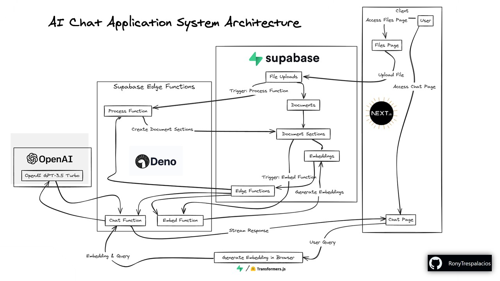

<h1 align="center">GPT Your Files</h1>

## Original Repository

This project was originally forked from [supabase-community/chatgpt-your-files](https://github.com/supabase-community/chatgpt-your-files).

## 💽 Clone

1. **Clone repo:** Clone this repo:

   ```shell
   git clone https://github.com/RonyTrespalacios/chatbot-your-files.git
   ```

   This will automatically clone our starting point.

## 🧱 Pre-req’s

- Unix-based OS (if Windows, WSL2)
- Docker
- Node.js 18+
- Deno 

## 💿 Sample Data

This repository includes 3 sample markdown files that we'll use to test the app:

[`./sample-files/file1.md`](./sample-files/file1.md)

[`./sample-files/file2.md`](./sample-files/file2.md)

[`./sample-files/file3.md`](./sample-files/file3.md)

<details>

<summary><strong>Step 0 - Setup</strong> <em>(Optional)</em></summary>

### `Step 0` - Setup

1. Create the droplet in digital ocean.

   ```bash
   ssh root@your-ip
   ```

1. Create a new user.

   ```bash
   adduser username
   ```
   ```bash
   usermod -aG sudo username
   ```
   ```bash
   su username
   ```

1. Go to /home/username/

   ```bash
   cd ~
   ```

1. Now you can clone the repo

   ```bash
   git clone https://github.com/RonyTrespalacios/chatbot-your-files.git
   ```

1. Basic setup:

#### Install npm
   ```bash
   sudo apt-get install npm
   ```

#### Install HomeBrew
   ```bash
   /bin/bash -c "$(curl -fsSL https://raw.githubusercontent.com/Homebrew/install/HEAD/install.sh)"
   ```
   ```bash
   echo 'eval "$(/home/linuxbrew/.linuxbrew/bin/brew shellenv)"' >> ~/.profile
   ```
   ```bash
   source ~/.profile
   ```
   ```bash
   cd chatbot-your-files/
   ```

#### Install Deno
   ```bash
   brew install deno
   ```

#### Install Docker
   ```bash
   sudo apt update
   sudo apt-get install apt-transport-https ca-certificates curl software-properties-common
   ```
   ```bash
   curl -fsSL https://download.docker.com/linux/ubuntu/gpg | sudo gpg --dearmor -o /usr/share/keyrings/docker-archive-keyring.gpg
   ```
   ```bash
   echo "deb [arch=amd64 signed-by=/usr/share/keyrings/docker-archive-keyring.gpg] https://download.docker.com/linux/ubuntu $(lsb_release -cs) stable" | sudo tee /etc/apt/sources.list.d/docker.list > /dev/null
   ```
   ```bash
   sudo apt-get update
   sudo apt-get install docker-ce docker-ce-cli containerd.io
   ```
   ```bash
   sudo usermod -aG docker $USER
   ```

#### Verify Docker and Deno are installed
   ```bash
   deno --version
   docker --version
   ```

</details>


### `Step 1` - Install dependencies

#### Install dependencies

First install NPM dependencies.

```bash
npm i
```

#### Setup Supabase stack

When developing a project in Supabase, you can choose to develop locally or directly on the cloud.

1. Start supabase

   ```bash
   npx supabase start
   ```

1. Store the Supabase URL & public anon key in `.env.local` for Next.js.

   ```bash
   npx supabase status -o env \
     --override-name api.url=NEXT_PUBLIC_SUPABASE_URL \
     --override-name auth.anon_key=NEXT_PUBLIC_SUPABASE_ANON_KEY |
       grep NEXT_PUBLIC > .env.local
   ```

1. In order to develop Supabase directly on the cloud:

    ```bash
    npx supabase projects create -i "ChatGPT Your Files"
    ```
    ```bash
    npx supabase link --project-ref=<project-id>
    ```
    ```bash
    NEXT_PUBLIC_SUPABASE_URL=<api-url>
    NEXT_PUBLIC_SUPABASE_ANON_KEY=<anon-key>
    ```

1.  How to apply the migration to our cloud database.

    ```bash
    npx supabase db push
    ```

1.  How to run the edge functions 

    ```bash
    npx supabase functions deploy
    ```

1.  If you are developing directly on the cloud, open up the [SQL Editor](https://supabase.com/dashboard/project/_/sql/new) and set this to your Supabase project's API URL:

    ```sql
    select vault.create_secret(
      '<api-url>',
      'supabase_url'
    );
    ```

    You can get the project API URL from the [API settings page](https://supabase.com/dashboard/project/_/settings/api).

#### Open AI API Key

1.  Generate an API key from [OpenAI](https://platform.openai.com/account/api-keys) and save it in `supabase/functions/.env`.

    ```bash
    cat > supabase/functions/.env <<- EOF
    OPENAI_API_KEY=<your-api-key>
    EOF
    ```

#### Frontend

1.  Run frontend at 3000 port.

    ```bash
    npm run dev
    ```

1.  Continue execution of the frontend.

    ```bash
    sudo npm install -g pm2
    ```
    ```bash
    pm2 start npm --name "nextjs-app" -- run dev
    ```

## 🔗 Supabase Vector resources

- [Supabase AI & Vector](https://supabase.com/docs/guides/ai)
- [pgvector Columns](https://supabase.com/docs/guides/ai/vector-columns)
- [pgvector Indexes](https://supabase.com/docs/guides/ai/vector-indexes)
- [Generate Embeddings using Edge Functions](https://supabase.com/docs/guides/ai/quickstarts/generate-text-embeddings)
- [Going to Production](https://supabase.com/docs/guides/ai/going-to-prod)
